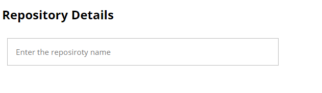
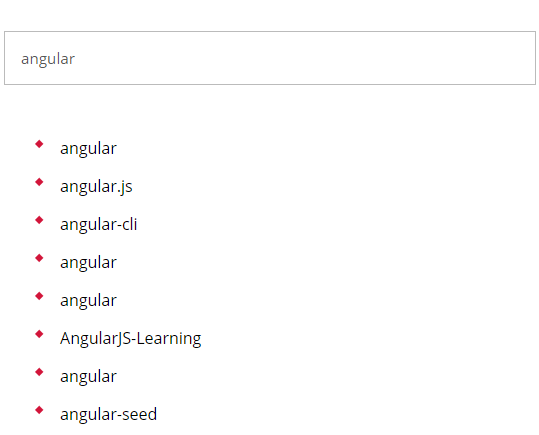
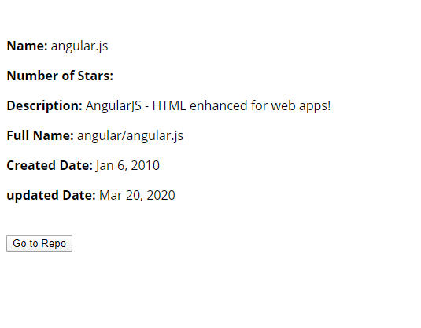

# ListApp
Sample application developed to view repository details.

### How to run the project!

  - Check out the project from [https://github.com/jayampathiw/ListApp](https://github.com/jayampathiw/ListApp)
  - Naviagte to ListApp folder.
  - Open a command prompt.
  - Enter`npm install` to install dependencies.
  - Enter`npm start` or `ng serve` to run the application.
  
### How to use the application.
  - Navigate to http://localhost:4200/ from your browser window.
  - You can use any user name or password to log in.
  - In the landing page, you will find the repository search text field.
  
  - Enter the search text you want to search.
  - All the results will be displayed on the page.
  
  - Clicking on a result page you can see the repository details next to the selected repository. 
  
